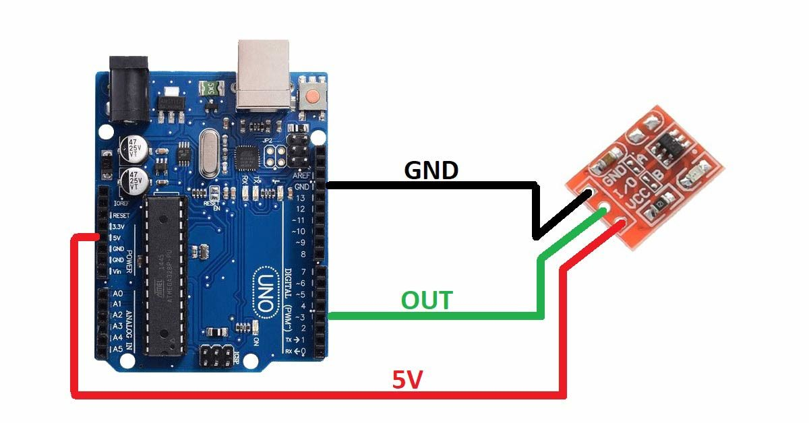

# Arduino Touch Sensor LED Toggle  

This project demonstrates how to use a **Touch Sensor** with an **Arduino** to toggle an LED **ON and OFF**.  
When the sensor is touched, the LED state changes, and the status is shown in the Serial Monitor.  

---

## 🔧 Components Required
- Arduino Uno (or compatible board)  
- Touch Sensor Module (TTP223 or similar)  
- LED 
- Breadboard & Jumper Wires  

---

## ⚡ Circuit Diagram
  

---

## 🎥 Demo Video
Check out the working demo on my **YouTube channel**:  
👉 [Ecempire7](https://www.youtube.com/@Ecempire7)  

---

## 🚀 How to Use
1. Connect the circuit as per the diagram.  
2. Upload the Arduino code from this repository.  
3. Open the **Serial Monitor** at 9600 baud.  
4. Touch the sensor to toggle the LED ON/OFF.  

